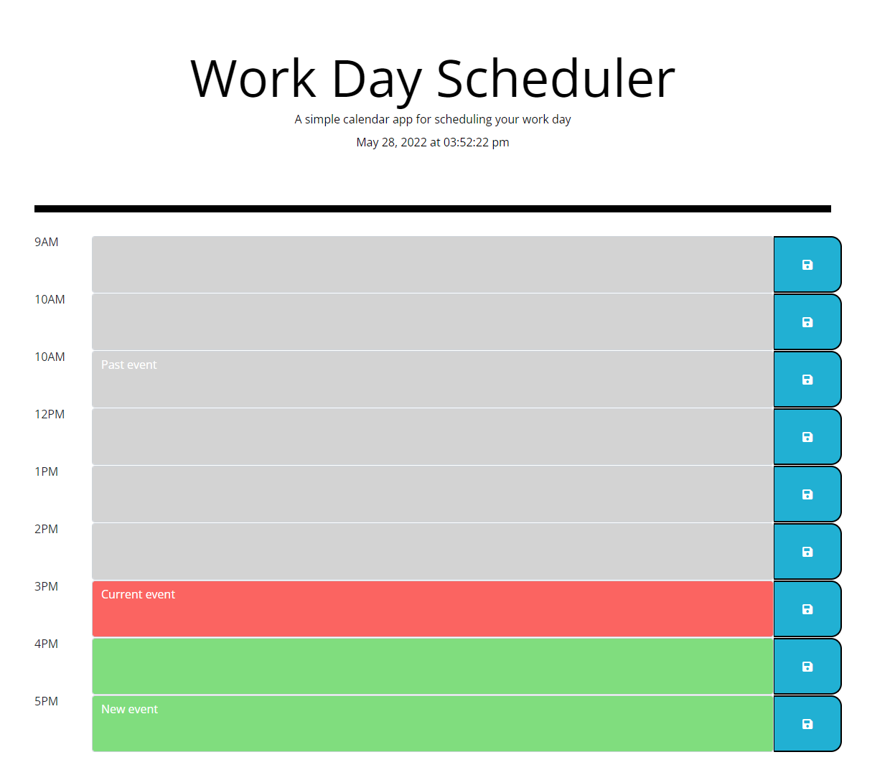

# **Work Day Scheduler**
## Webpage for the work day scheduler

### **Project Description:**
This website is a simple calendar application that allows a user to save events for each hour of the day. This app runs in the browser and features dynamically updated HTML and CSS powered by jQuery.

### **Technologies Used & Acceptance Criteria:**
This website uses these technologies to work properly:
- [HTML] - HyperText Markup Language.
- [CSS] - Cascading Style Sheets used as the style sheet language.
- [JS] - Advanced Javascript Language.
- [jQuery]
- [Bootstrap]
- [Moment.js]

This website was coded using the the Acceptance Criteria mentioned below:
- WHEN I open the planner, THEN the current day is displayed at the top of the calendar.
- WHEN I scroll down, THEN I am presented with time blocks for standard business hours.
- WHEN I view the time blocks for that day, THEN each time block is color-coded to indicate whether it is in the past, present, or future.
- WHEN I click into a time block, THEN I can enter an event.
- WHEN I click the save button for that time block, THEN the text for that event is saved in local storage.
- WHEN I refresh the page, THEN the saved events persist.

### **Deployed website link:**
https://rakibca.github.io/work-day-scheduler/

### **Credits:**
- [W3Schools](https://www.w3schools.com "W3Schools")
- [MDN Web Docs](https://developer.mozilla.org "MDN Web Docs")
- [Google](https://www.google.com "Google's Homepage")
- [Stack Overflow](https://stackoverflow.com "Stack Overflow website")
